  

# 🚀 Awesome Ad Mediation Platform

**The Definitive Curated List of Mobile Ad Mediation Platforms, SaaS Solutions &amp; Open-Source Projects**  
*Comprehensive resource for mobile game &amp; app developers, monetization managers, ad-tech engineers, and growth leads looking to maximize eCPM, fill rates, and advertising revenue via in-app bidding &amp; waterfall optimization.*

---

## 📖 Table of Contents

- [🌟 Overview &amp; Ecosystem Guide](#-overview--ecosystem-guide)
- [🏢 SaaS &amp; Hosted Ad Mediation Platforms](#-saas--hosted-ad-mediation-platforms)
- [🔓 Open-Source GitHub Projects](#-open-source-github-projects)
- [💡 Key Concepts: In-App Bidding vs. Waterfall](#-key-concepts-in-app-bidding-vs-waterfall)
- [🤝 How to Contribute](#-how-to-contribute)
- [📈 Star History](#-star-history)
- [⚠️ Disclaimer](#-disclaimer)

---

## 🌟 Overview &amp; Ecosystem Guide

**Mobile Ad Mediation** aggregates multiple advertising demand sources (ad networks, DSPs, and programmatic exchanges) into a single SDK integration. By conducting real-time in-app auctions or sequential waterfall queries, mediation engines maximize publisher **eCPMs (effective cost per mille)**, eliminate unsold inventory through near-100% **fill rates**, and automate operational yield management across iOS and Android apps.

### 🎯 Why Use Ad Mediation?
- ⚡ **Higher eCPMs &amp; Revenue Maximization**: Simultaneous real-time bidding forces demand partners to compete dynamically for every single impression.
- 🌐 **Global Fill Rate Coverage**: Backfill underperforming geos with local and regional ad networks without writing custom fallback logic.
- 📦 **Single Unified SDK**: Eliminate SDK bloat by managing adapters centrally rather than hardcoding dozens of separate ad network SDKs.
- 📊 **Automated Yield Analytics &amp; A/B Testing**: Segment user cohorts, test waterfall floors, and track cohort LTV / ARPU seamlessly.

---

## 🏢 SaaS &amp; Hosted Ad Mediation Platforms

The following SaaS and hosted platforms lead the mobile ad monetization industry. The table is ranked in descending order by **company size / valuation / annual revenue**:

| 🏢 Platform | 📊 Company Size &amp; Valuation | 📝 Description | 💵 Pricing | 🎁 Free Tier Limits |
| :--- | :--- | :--- | :--- | :--- |
| **[Google AdMob Mediation](https://admob.google.com/)** | **~$2.1T+ Market Cap / ~$350B+ Annual Revenue** (Alphabet Inc. NASDAQ: GOOGL) | Google's enterprise-grade mediation platform combining massive AdMob/Google Ad Manager demand with 30+ 3rd-party ad networks via open-source &amp; versioned adapters for waterfall and real-time bidding. | **$0 platform fee** (0% mediation fee for 3rd-party networks; standard Google revenue share applies solely to native AdMob Network demand: 68% publisher / 32% Google cut) | **Free forever** with unlimited mediated ad requests, impressions, and app integrations without volume or account usage caps. |
| **[AppLovin MAX](https://www.applovin.com/max/)** | **~$102B+ Market Cap / ~$5.5B+ Annual Revenue** (AppLovin Corp NASDAQ: APP) | Leading mobile ad mediation platform featuring AXON AI-powered real-time in-app bidding, cross-network waterfall optimization, and deep integration with AppLovin Exchange (ALX). | **$0 platform fee** (0% publisher fee for 3rd-party mediation; AppLovin monetizes via ~5% buyer bidding fee on ALX exchange and direct demand) | **Free forever** with unlimited apps, ad requests, impressions, and unrestricted access to in-app bidding, cohort analytics &amp; A/B testing tools. |
| **[Chartboost Mediation](https://www.chartboost.com/)** | **~$30B+ Market Cap** (Take-Two Interactive NASDAQ: TTWO; Zynga acquired Chartboost for $250M) | Unified programmatic auction and mediation platform (formerly Helium) tailored for mobile gaming publishers, featuring interstitials, rewarded videos, and playable ad formats. | **$0 platform fee** (0% upfront/monthly SDK license fee; monetized via auction exchange demand; standard payout fees apply e.g. $10–$25 per wire transfer) | **Free forever** with unlimited ad impressions, apps, and access to unified programmatic auction without usage caps. |
| **[Unity LevelPlay](https://unity.com/products/levelplay)** | **~$8.5B+ Market Cap / ~$2.1B+ Annual Revenue** (Unity Software Inc. NYSE: U) | Unity's specialized ad mediation platform (formerly ironSource) optimized for game studios, offering advanced user segmentation, automated A/B testing, in-app bidding, and Unity Ads integration. | **$0 platform fee** (0% publisher cut on 3rd-party network mediation; monetized through the broader Unity Ads demand ecosystem) | **Free forever** with unlimited impressions, apps, waterfalls, and ad units with no user, revenue, or feature limits. |
| **[Yodo1 MAS](https://www.yodo1.com/)** | **Private ($50M–$100M+ est. revenue; 1.5B+ game players reached)** | Managed Ad Services platform aggregating 17+ ad networks, automated AI waterfall/bidding optimization, and unified account management for indie and studio game developers. | **15% revenue share** on mediated ad revenue (0% upfront fee, $0/month subscription cost) | **Free integration forever** with $0 upfront cost, no trial expiration, and full access to 17+ managed ad networks and automated optimization (15% rev-share applies to earnings). |
| **[Appodeal](https://appodeal.com/)** | **Private ($20M–$50M+ est. revenue; $100M+ GMV managed)** | All-in-one growth and ad mediation platform featuring automated yield optimization, 70+ ad demand sources, in-app bidding, and built-in BI analytics &amp; user acquisition tools. | **$0 platform fee** (0% base software fee for mediation SDK and BI tools; monetized via demand partnerships and optional accelerator revenue share) | **Free forever** with unlimited impressions, unlimited apps, full access to 70+ ad demand sources, and BI analytics tools. |
| **[TradPlus](https://www.tradplus.com/)** | **Private ($15M–$30M+ est. revenue; 1B+ daily ad requests)** | Global mobile ad mediation platform supporting multi-network bidding, transparent waterfall analytics, and automated eCPM floor optimization across worldwide markets. | **$0 platform fee** (0% fee for standard 3rd-party network mediation; monetized via optional TPX programmatic exchange &amp; VisiX services) | **Free forever** with unlimited DAU, ad impressions, mediated networks, and analytics access without caps. |
| **[TopOn](https://www.toponad.com/)** | **Private ($10M–$25M+ est. revenue; 30B+ monthly ad requests)** | Mobile mediation management tool offering waterfall optimization, multi-network in-app bidding, and granular analytics tailored for hyper-casual, casual, and mid-core publishers. | **$0 platform fee** (0% commission on 3rd-party network mediation using own accounts; separate terms apply for optional TopOn ADX programmatic exchange) | **Free forever** with unlimited ad requests, apps, SDK mediation features, and reporting with no time limits. |
| **[CAS.AI](https://cas.ai/)** | **Private ($5M–$20M+ est. revenue; 500M+ monthly impressions)** | Automated ad mediation platform (Clever Ads Solutions) providing unified auctions, automated waterfall management, and yield optimization across 30+ ad networks. | **10% revenue share** on generated ad revenue (0% upfront fee, $0/month base cost) | **Free integration forever** with $0 upfront cost, no trial expiration, and full access to 30+ demand sources (10% rev-share applies to earnings). |

---

## 🔓 Open-Source GitHub Projects

Curated open-source SDKs, header bidding engines, protocol specifications, mediation adapters, and developer automation utilities. Ranked in descending order by **GitHub Star Count**:

1. **[Google Mobile Ads Unity Plugin](https://github.com/googleads/googleads-mobile-unity)**   
   Official Google Mobile Ads SDK plugin for Unity game engines supporting banner, interstitial, rewarded, and app open ad formats with third-party mediation adapters.

2. **[Prebid Server](https://github.com/prebid/prebid-server)**   
   High-performance open-source server-side header bidding engine written in Go and Java, orchestrating real-time OpenRTB programmatic auctions across mobile apps and web.

3. **[OpenRTB Specification](https://github.com/InteractiveAdvertisingBureau/openrtb)**   
   The definitive Real-Time Bidding API standard developed by the IAB Tech Lab, forming the backbone communication layer for programmatic in-app bidding and mediation exchanges.

4. **[Google Mobile Ads Flutter Plugin](https://github.com/googleads/googleads-mobile-flutter)**   
   Official Flutter plugin for Google Mobile Ads providing native Android and iOS ad rendering, mediation adapters, and monetization support in Flutter apps.

5. **[Google Mobile Ads Android Mediation Adapters](https://github.com/googleads/googleads-mobile-android-mediation)**   
   Official open-source repository containing Android mediation adapters (AppLovin, Unity, Meta Audience Network, DT Exchange, InMobi, Mintegral, Liftoff, etc.) for Google AdMob.

6. **[LARSAdController](https://github.com/larsacus/LARSAdController)**   
   Lightweight iOS ad mediation manager enabling dynamic switching, failover, and waterfall management across multiple mobile advertising networks.

7. **[AppLovin MAX Unity Plugin](https://github.com/AppLovin/AppLovin-MAX-Unity-Plugin)**   
   Official Unity integration plugin for AppLovin MAX with open-source network adapters for in-app bidding and cross-network optimization.

8. **[Google Mobile Ads iOS Mediation Adapters](https://github.com/googleads/googleads-mobile-ios-mediation)**   
   Official open-source iOS mediation adapters and sample source code for integrating third-party demand networks into Google Mobile Ads on Apple platforms.

9. **[OpenMediation](https://github.com/OpenMediationProject/OpenMediation)**   
   Full-stack open-source mobile ad mediation system complete with Android &amp; iOS SDKs, server-side auction decisioning logic, and a multi-network dashboard.

10. **[Prebid Mobile Android SDK](https://github.com/prebid/prebid-mobile-android)**   
    Open-source Android SDK for client-side mobile header bidding, sending bids into primary ad servers (AdMob, GAM, AppLovin MAX) before the waterfall triggers.

11. **[Prebid Mobile iOS SDK](https://github.com/prebid/prebid-mobile-ios)**   
    Open-source iOS SDK for mobile in-app header bidding, enabling fair programmatic competition among demand sources directly on iOS devices.

12. **[Easy Ads (Multi-Network Mediation Wrapper)](https://github.com/nooralibutt/easy-ads)**   
    Android wrapper architecture streamlining multi-network mediation fallback across Google AdMob, AppLovin MAX, Unity Ads, and Meta Audience Network.

13. **[Godot AppLovin MAX Plugin](https://github.com/DrMoriarty/godot-applovin-max)**   
    Open-source plugin connecting the Godot Game Engine to AppLovin MAX mediation for rewarded, interstitial, and banner mobile ads.

14. **[Start.io AdMob Mediation Adapter](https://github.com/StartApp-SDK/android-admob-mediation)**   
    Open-source Android mediation adapter enabling Start.io demand integration within Google AdMob waterfall and bidding mediation groups.

15. **[SotiAds](https://github.com/shtse8/SotiAds)**   
    Automation suite for AdMob ad unit generation, mediation group management, and dynamic eCPM floor tuning with Firebase Remote Config sync.

16. **[Ad Mediator SDK Architecture Example](https://github.com/fatemeh-afshari/ad-mediator-SDK)**   
    Clean Architecture Android mediation SDK demo built with Kotlin, Hilt, Coroutines, Retrofit, Room, and Moshi managing multi-network ad orchestration.

---

## 💡 Key Concepts: In-App Bidding vs. Waterfall

| Feature | ⚡ In-App Bidding (Advanced Header Bidding) | 🌊 Traditional Waterfall Mediation |
| :--- | :--- | :--- |
| **Auction Mechanism** | Simultaneous, real-time programmatic auction where all demand partners bid concurrently. | Sequential daisy-chain request model ordered by historical average eCPM estimates. |
| **eCPM Efficiency** | Maximum yield; ad impression is awarded to the highest real-time bidder. | Sub-optimal yield; higher bidders lower in the chain may never receive the ad request. |
| **Latency** | Low latency; single simultaneous asynchronous auction request. | Higher latency; sequential failovers increase time-to-render for ads. |
| **Operational Overhead** | Low; dynamic pricing eliminates manual waterfall floor maintenance. | High; requires continuous manual optimization of eCPM floors and geo line items. |
| **Transparency** | Complete bid-level pricing visibility across participating demand partners. | Limited transparency based on aggregated post-campaign reporting. |

---

## 🤝 How to Contribute

Contributions are warmly welcomed! Help keep this curated ad mediation index up-to-date and comprehensive.

1. 🍴 **Fork the repository**
2. 🌿 **Create your feature branch** (`git checkout -b feature/add-new-ad-mediation-tool`)
3. 📝 **Add or update entries** in `README.md` (keep descriptions factual, include official URLs, star badges, pricing, and free tier limits)
4. 💾 **Commit your changes** (`git commit -m "Add [Tool Name] to Ad Mediation repository"`)
5. 🚀 **Push to the branch** (`git push origin feature/add-new-ad-mediation-tool`)
6. 📬 **Open a Pull Request** with a brief summary of the addition

⭐ **Don't forget to star the repository if you found it useful!**

---

## 📈 Star History

---

## ⚠️ Disclaimer

- This is a **community-curated** list for educational, evaluation, and informational purposes — inclusion does not constitute a formal commercial endorsement.
- Mobile ad mediation involves programmatic contracts, revenue shares, ad network policies, and privacy compliance standards (**GDPR, CCPA, COPPA, Google Families Policy, Apple App Tracking Transparency (ATT)**). Publishers are responsible for verifying compliance.
- Open-source mediation SDKs and adapters require ongoing maintenance, testing, and alignment with underlying ad network SDK releases to maintain stability and fill rates.

---

Made with ❤️ for mobile game developers, indie publishers, and ad-tech engineers worldwide.

